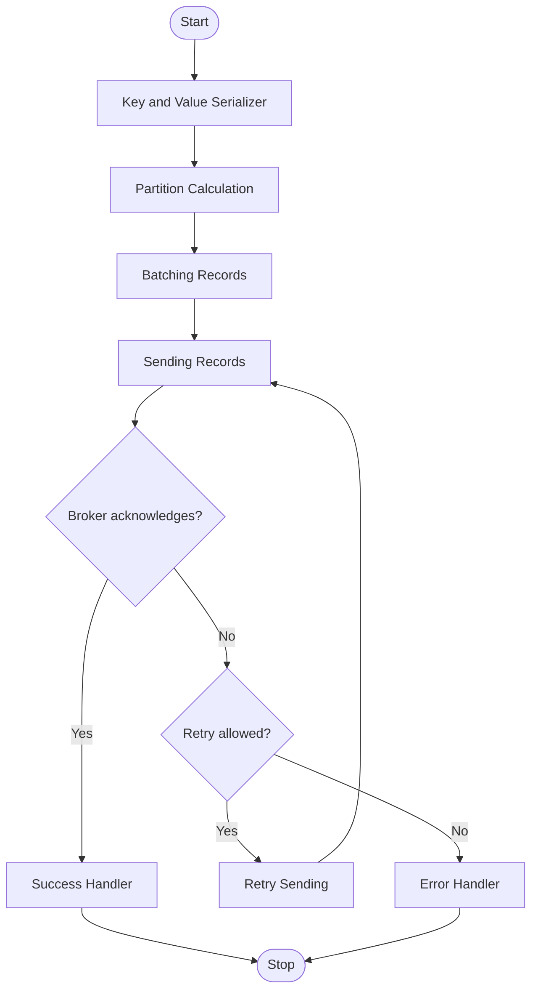

# Kafka Producer Workflow

```mermaid
flowchart TD
    A([Start]) --> B[Key and Value Serializer]
    B --> C[Partition Calculation]
    C --> D[Batching Records]
    D --> E[Sending Records]
    E --> F{Broker acknowledges?}

    F -- Yes --> G[Success Handler]
    G --> H([Stop])

    F -- No --> I{Retry allowed?}
    I -- Yes --> J[Retry Sending]
    J --> E
    I -- No --> K[Error Handler]
    K --> H
```